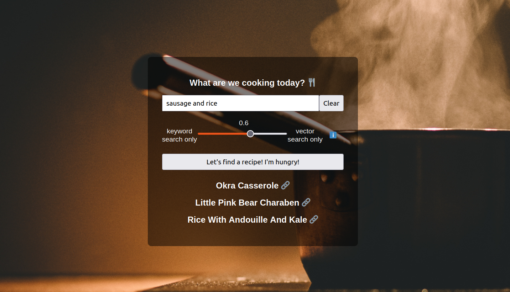

# Recipe Search

## A few words about this project

The aim of the project is to create a website, where users will search for recipes based on ingredients or even more abstract terms. They will receive the titles of the three more relevant recipes accompanied by the link where they could find the recipes. 

In more detail, we setup a worklfow with Weaviate, where we created a vector database of 6000 recipes. The data used to create the database is a subset of the [Recipe Dataset (over 2M) Food](https://www.kaggle.com/datasets/wilmerarltstrmberg/recipe-dataset-over-2m/data) from Kaggle. The original dataset consists of 2231142 data. After careful considerations, we realized that not all the sites of the dataset are still active, so we decided to remove those that are not online. In the remaining 1263470 data we randomly sampled 6000. The dataset has 7 columns namingly, title, ingredients, directions, link, source, NER and site. We created a new column that had the NERs as comma separated strings and this column is the one that was vectorized in our database using OpenAI's text-embedding-3-small model. In the database we also included the title, the ingredients, the directions and the link as properties. 

We used Weaviate's NER module with the [FoodBaseBERT](https://huggingface.co/Dizex/FoodBaseBERT-NER), a fine-tuned BERT model used for Named Entity Recognition of Food entities from Hugging face. The entities that FoodBaseBERT identifies are tokens, not words (e.g. Pudding was recognized as three tokens P, ##uddin and ##g while in Wholewheat the second was skipped and we have two tokens Whole and #heat). On the other hand the database had entities as words, so we had to convert the tokens to words. In ```ner_module/ner.py``` you will find the ```reconstruct_words_with_metadata``` function for the conversion. It is responsible not only for token joins but also deletions, for example the tokens identified as food entities starting with ## were removed if they were not preceded by an identified food entity.

Finally, the workflow also has a frontend where users can visit to get the recipes. The frontend is written in HTML, CSS, and JavaScript.

The three services are containerized using the Docker Compose tool.

In conclusion, when the user requests a recipe based on an ingredient, the food-based NER module will detect known entities in the input text and find the closest recipe that exists in our database using Weaviate's hybrid search.



## Instructions

1. Clone the repo locally or just download the current folder.

2. Download the [Recipe Dataset (over 2M) Food](https://www.kaggle.com/datasets/wilmerarltstrmberg/recipe-dataset-over-2m/data) from Kaggle and put them in the database_creation folder.

3. Set the OpenAI's API key as environmental variable (you can follow OpenAI's guidelines [here](https://help.openai.com/en/articles/5112595-best-practices-for-api-key-safety)) and also add you key to the docker-compose.yml file in the field OPENAI_APIKEY.

4. Build and start the three linked services with the command:

```bash
docker-compose up --build
```

5. Get into the database_creation folder, install the requirements with the command:

```bash
pip install -r requirements.txt
```

and then run the weaviate_notebook.ipynb

6. Open your Browser and in the search bar write either localhost or 0.0.0.0

7. You are done! In case you want to close everything uncomment and run the final cell of the weaviate_notebook.ipynb and click Ctl + C to the terminal that runs docker services.
